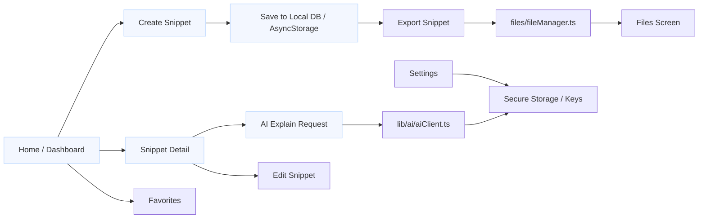

# DevSnippets-AI

DevSnippets-AI is a small, local-first Expo React Native app for creating, managing, and explaining code snippets using AI helpers. It provides snippet creation, file management, AI explanations, and export features with a clean UI and simple developer workflow.

## Key Features
- Create, edit, and delete code snippets.
- Store snippets locally (secure and async storage).
- AI-powered explanations and analysis for snippets.
- File management and snippet export abilities.
- Lightweight UI components and a modular codebase.

## Quick Start
Prerequisites:
- Node.js (18+ recommended)
- npm or yarn
- Expo CLI (optional; you can use `npx expo`)

Install and run locally:

```bash
# install dependencies
npm install

# start the Expo dev server
npm start

# or, using npx
npx expo start
```

Open the app on an emulator or your phone via the Expo Go app.

## Development Workflow
- Run the app with `npm start` and use the Expo dev tools to load on simulator/device.
- Edit TypeScript/TSX files under the `app/`, `components/`, and `lib/` folders.
- UI components live under `components/` and `components/ui/` for shared primitives.

## File structure
Below is the top-level structure and a short description of important files and folders.

```
AGENTS.md
app.json
babel.config.js
index.ts
LICENSE
metro.config.js
package.json
README.md
tsconfig.json
app/
	_layout.tsx            # App layout and route wrapper
	index.tsx              # App root route
	favorites.tsx          # Favorites page
	files.tsx              # File listing UI
	settings.tsx           # Settings screen
	snippet/
		[id].tsx           # Snippet detail route
		create.tsx         # Snippet creation screen
		ai-explain/
			[id].tsx       # AI explanation view for a snippet
assets/                    # Images, fonts, icons
components/
	files/
		FileCard.tsx       # File preview card
	layout/
		SearchBar.tsx      # Top search component
		TopNav.tsx         # Navigation bar
	snippet/
		CodeViewer.tsx     # Read-only code viewer
		LanguageBadge.tsx  # Language label UI
		SnippetCard.tsx    # Snippet list card
		SnippetForm.tsx    # Form to create/edit snippets
	ui/                    # Reusable UI primitives (Button, Input, Card...)
constants/
	languages.ts           # Supported languages list
	theme.ts               # Design tokens and theme
hooks/
	useAI.ts               # Hook wrapping AI client calls
	useFiles.ts            # File operations hook
	useSnippets.ts         # Snippet list + CRUD hook
	useTheme.tsx           # Theme hook
lib/
	events.ts              # App event helpers
	ai/
		aiClient.ts        # AI client wrapper (API calls)
db/
	database.ts            # Local DB glue (if present)
	snippets.ts            # Data access for snippets
export/
	exportSnippet.ts       # Export snippet logic
files/
	fileManager.ts         # File system helpers
storage/
	asyncStorage.ts        # Async storage layer
	secureStorage.ts       # Secure storage layer
types/
	index.ts               # Shared TypeScript types/interfaces
```

## Architecture / Flow Diagram
The diagram below shows the primary app flows: creating, storing, viewing, and AI-explaining snippets.



## Important files explained
- `app/_layout.tsx`: Root layout and navigation container.
- `app/snippet/create.tsx`: Snippet creation screen — form validation lives in `components/snippet/SnippetForm.tsx`.
- `lib/ai/aiClient.ts`: Centralized AI API integration; update this to change AI provider or API keys.
- `db/snippets.ts`: Persistent snippet store wrapper used by hooks.
- `components/ui/*`: Reusable components. Use these for consistent styling across the app.

## User interactions (how the app works)
- Home: browse recent or featured snippets.
- Create snippet: tap “New” or use the create screen to enter title, language, code, and tags. Save to persist locally.
- View snippet: open a snippet to see code rendered with `CodeViewer` and metadata.
- AI explain: from a snippet, tap “Explain” to generate an AI-powered explanation (powered by `useAI` and `lib/ai/aiClient.ts`).
- Files: manage imported or exported files via the Files screen and `files/fileManager.ts`.
- Settings: configure app-level preferences such as theme or storage options.

## Environment & configuration
- API keys or sensitive config should be provided via environment variables or a secure storage mechanism (see `storage/secureStorage.ts`).
- To swap AI providers, modify `lib/ai/aiClient.ts` and update `hooks/useAI.ts` as needed.

## Tests
There are no automated tests included by default. Add unit and integration tests under a `__tests__` folder and wire up Jest or a preferred test runner.

## Contributing
- Fork the repo, create a feature branch, and open a pull request against `main`.
- Keep changes focused and add tests when adding logic.

## License
This project uses the license in the `LICENSE` file.

## Contact
If you need help or want to contribute, open an issue or pull request on the repository.

---
If you'd like, I can also:
- add a short CONTRIBUTING.md with developer setup steps,
- scaffold tests and CI config,
- or generate a quick environment example showing how to set AI API keys.

